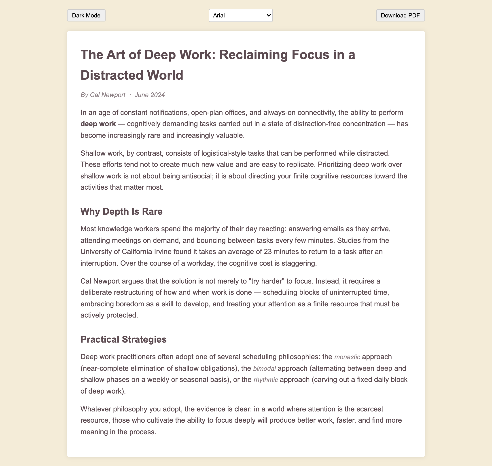

# Simple Reader Mode

A Chrome extension that strips away ads, navigation, and clutter from any webpage and presents just the article content in a clean, readable view.

## How it works

Click the extension icon on any article or blog post. A new tab opens instantly with the main content extracted — no distractions, no noise.

## Features

- **Light & dark mode** — toggle between a warm parchment light theme and a dark theme
- **Font picker** — choose between Arial, Georgia, Times New Roman, or Courier New
- **Download as PDF** — print the clean reader view to PDF via the browser's print dialog
- Powered by [Mozilla Readability](https://github.com/mozilla/readability), the same library behind Firefox Reader View

## Screenshots

**Light mode**

**Dark mode**

## Installation

This extension is not on the Chrome Web Store. Load it as an unpacked extension:

1. Open Chrome and go to `chrome://extensions`
2. Enable **Developer mode** (top-right toggle)
3. Click **Load unpacked** and select this folder
4. The extension icon will appear in your toolbar

## Usage

Navigate to any article, then click the extension icon. A new tab opens with the reader view. Use the controls at the top to switch themes, change the font, or save to PDF.
